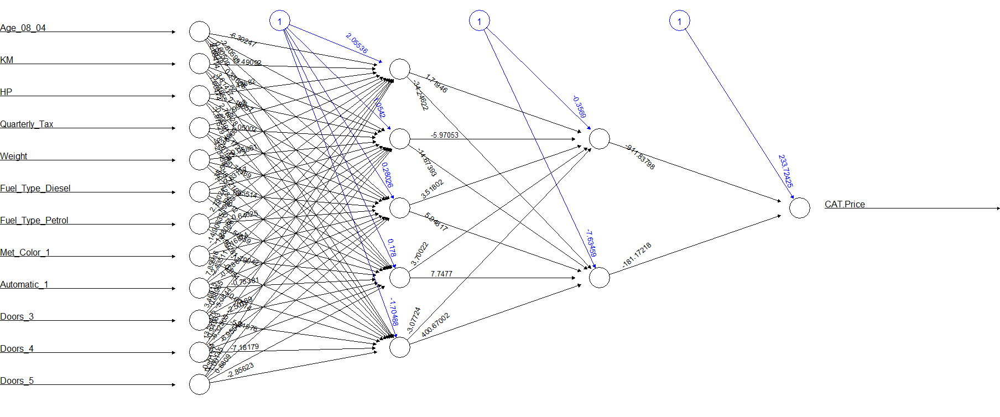

#  Toyota Corolla Pricing Strategy

## Project Overview

This project focuses on helping a car dealership make smarter pricing decisions for used Toyota Corolla cars.  
Instead of relying only on experience or guesswork, the goal was to use data to predict which cars are likely to sell above the average price.  

Using real sales data from the Netherlands, two models were built and compared:
- A **Neural Network** model that finds patterns and relationships in the data automatically.  
- A **Logistic Regression** model that provides a simpler and more interpretable view of which features matter most.  

Both models performed well, reaching around **90% accuracy**, showing that data-driven pricing can be both practical and effective.

---

## Business Problem

For any dealership, setting the right price for a used car is one of the most important and difficult tasks.  
If a car that could sell for a premium is priced too low, the dealership loses profit.  
If a car is priced too high, it may stay unsold for too long.  

Most pricing decisions are made based on experience or simple assumptions, such as “newer cars with fewer kilometers are worth more.”  
While this is often true, other factors like **horsepower, fuel type, transmission, and color** also play a big role in how buyers perceive value.  
Relying on intuition alone can lead to inconsistency and missed opportunities.  

This project uses data from 1,000 Toyota Corolla listings to answer a simple but important question:

> Can we predict whether a used Toyota Corolla will sell above the average market price based on its specifications?

By answering this, the dealership can price cars more confidently, identify high-value listings faster, and plan marketing efforts around cars that are likely to bring higher profit.

---

## Data and Preparation

The dataset `ToyotaCorolla.csv` includes details of used Toyota Corollas sold in 2004.  
For this analysis, the first **1,000 records** and the most relevant variables were used:  
`Age_08_04`, `KM`, `Fuel_Type`, `HP`, `Met_Color`, `Automatic`, `Doors`, `Quarterly_Tax`, and `Weight`.

A new column called `CAT.Price` was created:
- `1` for cars priced **above average**
- `0` for cars **not above average**

Categorical variables like **Fuel Type** and **Transmission** were converted into numerical form so the models could understand them.  
All numeric features were also scaled so that no single variable dominated the results.  
The dataset was divided into **70% training data** and **30% testing data** using random sampling for fairness.

The data showed that around **37% of cars** were priced above the average, which means the model had a balanced mix of both types to learn from.

---

## Modeling Approach

### Neural Network Model

The neural network was trained using the `neuralnet` package with two hidden layers.  
It learns relationships between inputs automatically and identifies patterns that may not be obvious to humans.  
The model successfully captured how multiple car features work together to determine if a car is likely to be priced above average.

---

## Model Evaluation

Both models were tested on unseen data to check how well they performed.

| Metric | Neural Network | Logistic Regression |
|--------|----------------|---------------------|
| Accuracy | 90.0% | 89.3% |
| Sensitivity (Below-Average Cars) | 91.5% | 90.5% |
| Specificity (Above-Average Cars) | 86.9% | 86.9% |
| Balanced Accuracy | 89.2% | 88.7% |

Both models did a strong job, with the neural network being slightly more balanced overall.

---

## Model Insights and Interpretation

The two models work in different ways but tell a similar story about what makes a Toyota Corolla stand out in the market.

### Insights from Logistic Regression

This model helps explain **how much each feature affects price**:

- **Age and KM:** Older cars and those with higher mileage are less likely to be priced above average.  
- **Horsepower:** Cars with higher horsepower are more likely to sell for a higher price because buyers value performance.  
- **Automatic Transmission:** Automatic cars often attract higher prices since they are more convenient for daily driving.  
- **Fuel Type:** Diesel cars usually have better resale value than Petrol or CNG models because of fuel efficiency and engine durability.  
- **Weight and Tax:** Heavier cars with higher road tax often belong to premium versions with better features.  

These results show clear and measurable patterns that can guide pricing and sales discussions.

### Insights from the Neural Network

The neural network provided a deeper look into how different features work together.  
It found patterns that the logistic model could not easily capture:

- Cars with a strong mix of performance and comfort features, like **high horsepower, automatic transmission, and metallic color**, can still sell above average even if they are older or have more kilometers.  
- Some relationships are not linear. For example, increasing horsepower helps up to a point, after which the effect levels off.  
- The model naturally grouped features that reflect **performance** (HP, Weight, Fuel Type) and **condition** (Age, KM, Transmission).  
- It showed consistent classification, recognizing both high-value and regular cars with very little bias.

Overall, the neural network was slightly better at identifying the hidden combinations of features that make a car more valuable, giving the dealership an advantage when pricing used vehicles.

---

## Technical Summary

**Tools Used:**  
R, `neuralnet`, `glm`, `caret`, `fastDummies`, `dplyr`

**Main Steps:**  
- Data cleaning and transformation  
- Feature scaling and dummy variable creation  
- Model training using Neural Network and Logistic Regression  
- Evaluation using confusion matrices and accuracy metrics  

---

## Key Takeaways

- Data-driven models can predict high-value cars with around 90% accuracy.  
- The **Logistic Regression model** explains which features influence price the most.  
- The **Neural Network model** finds deeper patterns and combinations that are not easily visible.  
- Together, they help the dealership make fair, consistent, and profitable pricing decisions.

---

## Author

**Rishi Sanmitra Pillutla**  
Aspiring Data Analyst | Passion for Turning Data into Insights | Transforming Data into Business Solutions 

🔗 [LinkedIn](https://www.linkedin.com/in/rishisanmitra/)  
🔗 [DataSciencePortfol.io](https://www.datascienceportfol.io/rishisanmitra12)
